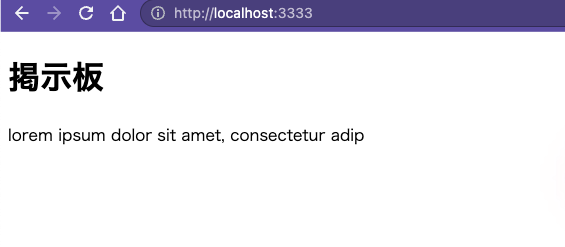

# Rails example LunchBox

## Scaffoldでお弁当注文一覧の作成

スカフォルド\(足場\)

### rails g scaffold データモデル名 データ属性:形式\(複数\)

**データモデル名 = テーブル名**

↑ Ruby &gt; クラス = 大文字かつ単数形

↓ Box = お弁当箱一覧

**データ属性と命名**

* 弁当の名前: name
* 価格: price
* 説明: content
* 画像: tagname
  * 画像ファイル名に属性を加える

**データベース形式**

* SQLite3 = 文字列: text

  ↑

  ↓

* Rails
  * string: テキストフィールド
  * text: テキストエリア

| 属性名 | 形式 |
| :--- | :--- |
| name\(名前\) | string |
| tagname（識別名） | string |
| price（価格） | integer |
| content （内容） | text |

データベース＆各操作/表示画面の生成: `$ rails g scaffold Box name:string tagname:string price:integer content:text`

```text
　   invoke  active_record
      create    db/migrate/20190113190226_create_boxes.rb
      create    app/models/box.rb
      invoke    test_unit
      create      test/models/box_test.rb
      create      test/fixtures/boxes.yml
      invoke  resource_route
       route    resources :boxes
      invoke  scaffold_controller
      create    app/controllers/boxes_controller.rb
      invoke    erb
      create      app/views/boxes
      create      app/views/boxes/index.html.erb
      create      app/views/boxes/edit.html.erb
      create      app/views/boxes/show.html.erb
      create      app/views/boxes/new.html.erb
      create      app/views/boxes/_form.html.erb
      invoke    test_unit
      create      test/controllers/boxes_controller_test.rb
      create      test/system/boxes_test.rb
      invoke    helper
      create      app/helpers/boxes_helper.rb
      invoke      test_unit
      invoke    jbuilder
      create      app/views/boxes/index.json.jbuilder
      create      app/views/boxes/show.json.jbuilder
      create      app/views/boxes/_box.json.jbuilder
      invoke  assets
      invoke    coffee
      create      app/assets/javascripts/boxes.coffee
      invoke    scss
      create      app/assets/stylesheets/boxes.scss
      invoke  scss
      create    app/assets/stylesheets/scaffolds.scss
```

### DBを入れる

`$ rails db:migrate`

### 新規データ作成画面





